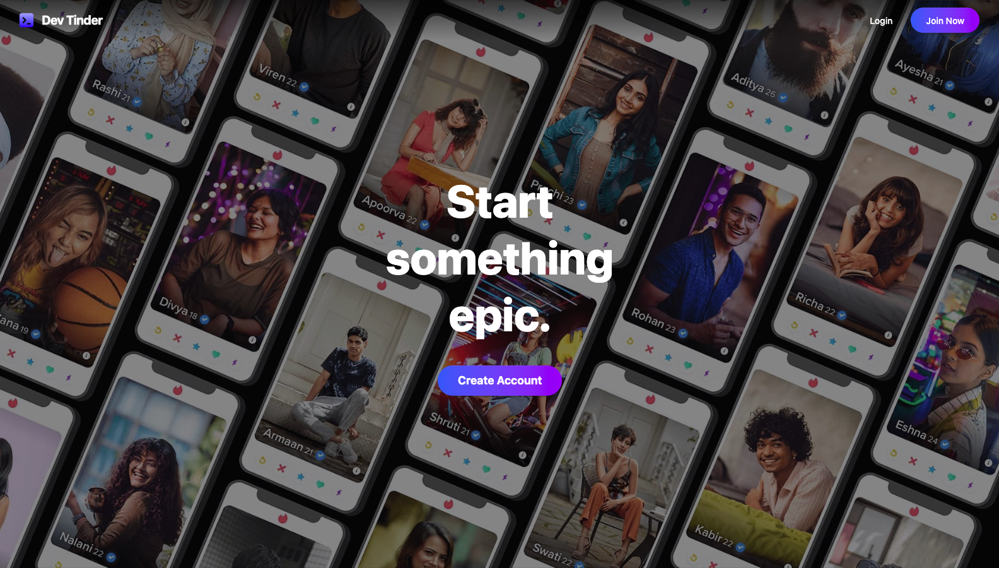
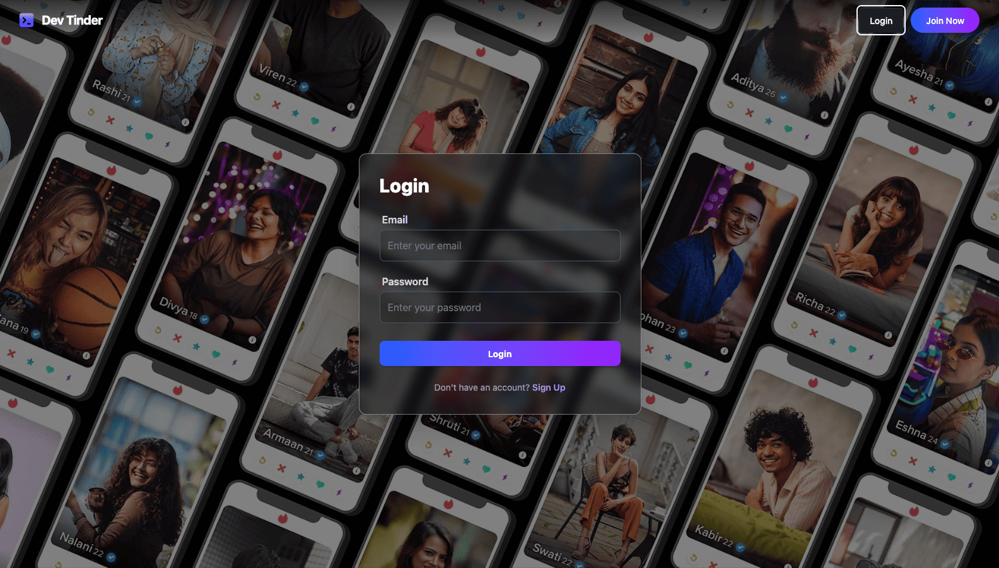
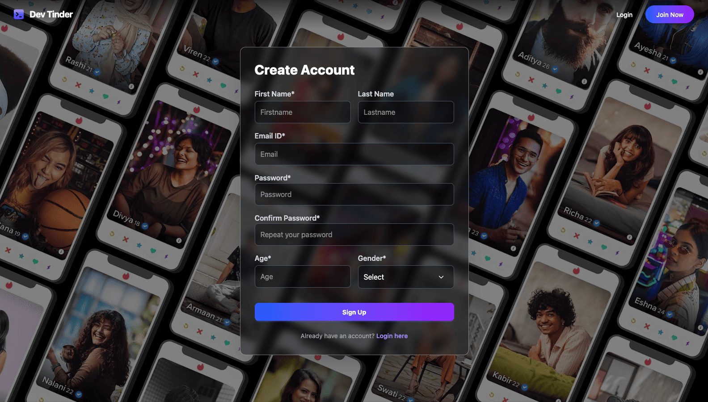
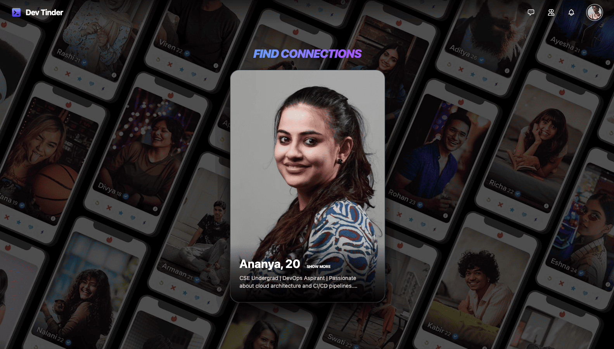
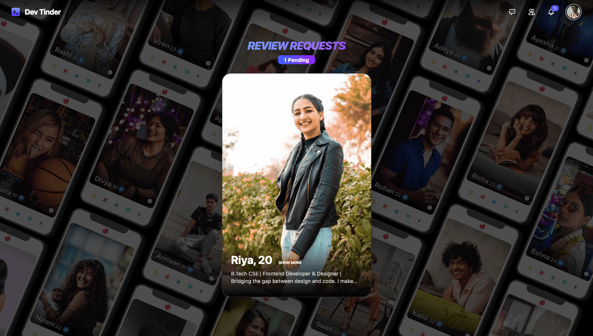
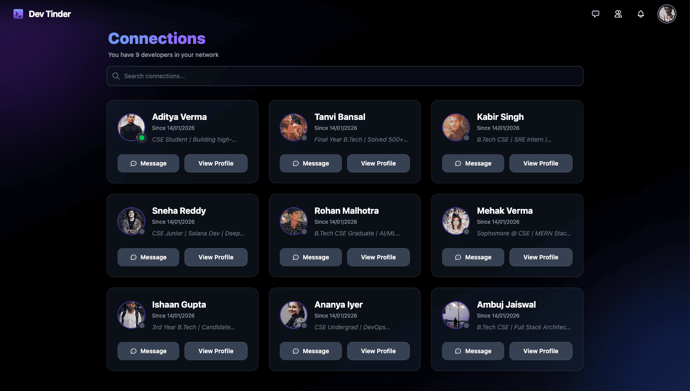
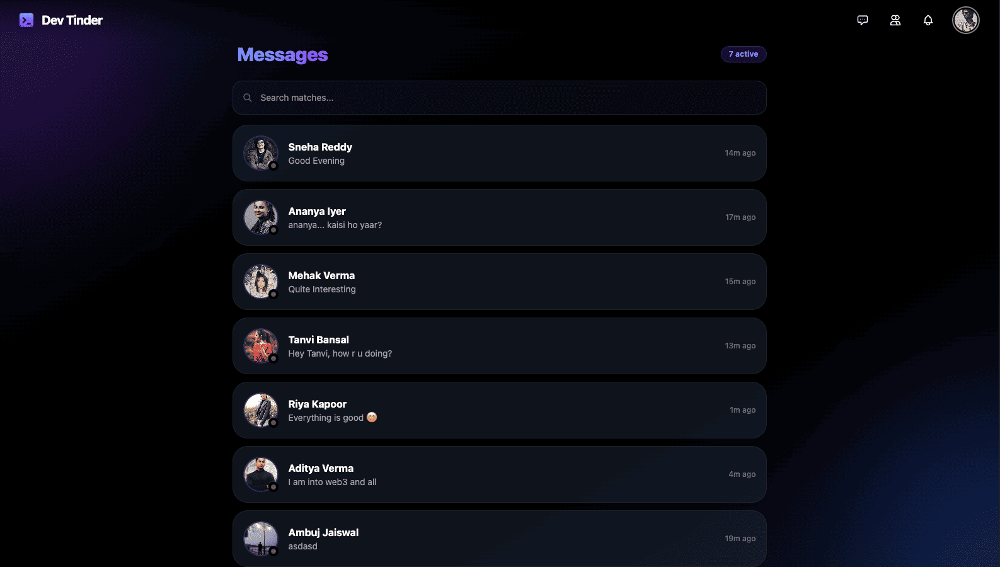
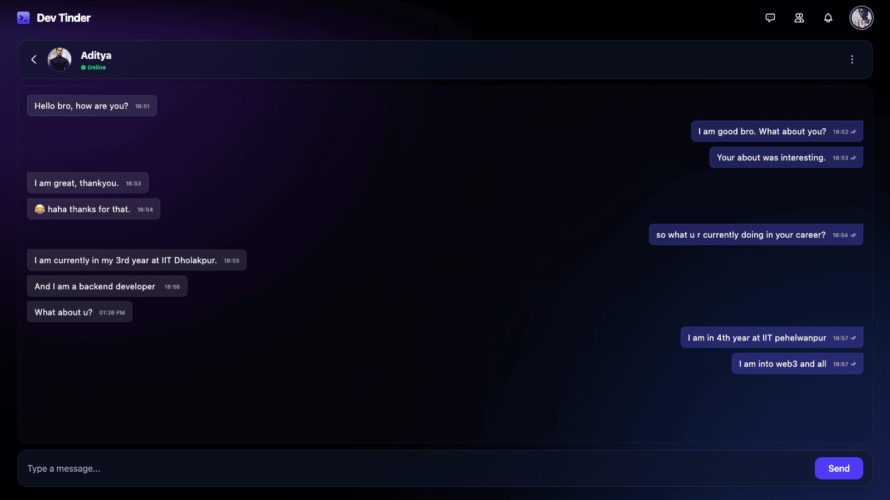
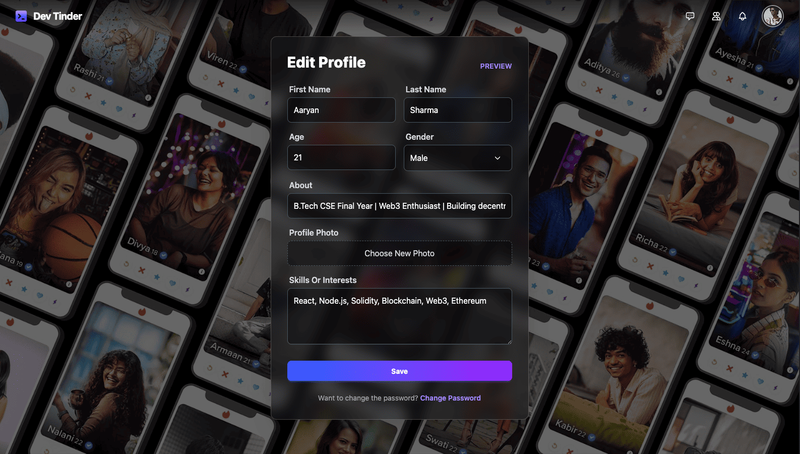
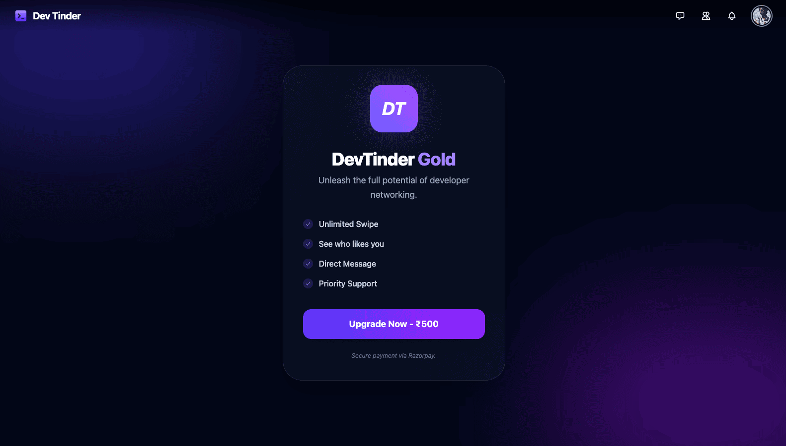

# DevTinder - Developer Connection Platform

## 🚀 Overview

**DevTinder** is a robust, full-stack social networking application designed specifically for developers to connect, collaborate, and network. Think of it as "Tinder for Developers." Users can swipe through profiles, send connection requests, chat in real-time, and upgrade to premium memberships.

This project goes beyond basic CRUD operations, implementing advanced backend engineering concepts like **Job Queues (Bull)**, **Scheduled Tasks (Cron)**, **AWS Email Integration (SES)**, **Payment Gateways (Razorpay)**, and **Cloud Storage (Cloudinary)**.

**🔗 Live Demo:** [https://iambuzzdev.in/](https://iambuzzdev.in/)

---

## 📸 App Screenshots

| **1. Home Screen** | **2. Login** |
| :---: | :---: |
|  |  |
| **3. Signup** | **4. Find Connections (Feed)** |
|  |  |
| **5. Connection Requests** | **6. Connections List** |
|  |  |
| **7. Messages** | **8. Real-Time Chat** |
|  |  |
| **9. Edit Profile** | **10. Buy Premium** |
|  |  |

---

## 🛠 Tech Stack & Libraries

### Frontend
- **React.js:** Component-based UI library.
- **Vite:** Next-generation frontend tooling.
- **Redux Toolkit:** State management (User, Feed, Chat, Requests).
- **Tailwind CSS & DaisyUI:** Rapid UI development and styling.
- **Socket.io-client:** Real-time bi-directional communication.
- **Axios:** Promise-based HTTP client.

### Backend (Node.js ecosystem)
The backend is highly scalable, utilizing the following libraries:

- **Core Framework:** `express`, `dotenv`, `cross-env`, `cors`, `cookie-parser`.
- **Database:** `mongoose` (MongoDB Object Modeling).
- **Authentication & Security:** `jsonwebtoken` (JWT), `bcrypt` (Hashing), `validator` (Input sanitization).
- **Real-Time Engine:** `socket.io` (WebSockets for Chat & Status).
- **File Storage:** `cloudinary`, `multer`, `multer-storage-cloudinary` (Profile photo uploads).
- **Payments:** `razorpay` (Payment gateway integration).
- **Email Service:** `@aws-sdk/client-ses` (Amazon Simple Email Service).
- **Task Queues:** `bull` (Redis-based queue for background job processing).
- **Scheduling:** `node-cron` (Cron jobs for automated tasks).

### Infrastructure & Deployment
- **Cloud Provider:** **AWS EC2** (Ubuntu Instance).
- **Process Management:** **PM2** (Production Process Manager for Node.js).
- **Web Server:** **Nginx** (Reverse Proxy).
- **DNS & Security:** **Cloudflare** (CDN, DDoS protection, SSL).
- **Domain Registrar:** **Hostinger**.
- **Database Hosting:** MongoDB Atlas.

---

## ✨ Key Features

### 1. Advanced Authentication & Profile
- **Secure Auth:** JWT-based authentication with HTTP-Only Cookies.
- **Profile Management:** Edit bio, skills, age, gender, and upload profile pictures directly to **Cloudinary**.
- **Input Validation:** Strict server-side validation using `validator.js`.

### 2. Connection Logic (The Feed)
- **Swipe Mechanism:** Users can mark profiles as "Interested" or "Ignored".
- **Matching Algorithm:** Shows users you haven't interacted with yet.
- **Request Management:** View, Accept, or Reject incoming connection requests.

### 3. Real-Time Chat & Status
- **Instant Messaging:** Powered by `Socket.io` for seamless communication between connected users.
- **Online Presence:** Real-time Green/Grey dot indicators showing if a user is online.
- **Live Notifications:** Badges update instantly when a new message or request arrives.

### 4. Premium Membership (Monetization)
- **Razorpay Integration:** Users can purchase Silver or Gold memberships.
- **Order Flow:** Create Order -> Payment Processing -> Webhook/Verification.

### 5. Backend Asynchronous Processing
- **Email Notifications:**
  - Automated emails (Welcome, New Connection) sent using **AWS SES**.
  - **Bull Queues:** Emails are offloaded to a Redis queue to prevent blocking the main server thread.
- **Scheduled Maintenance:**
  - **Node-cron** runs daily scripts to clean up expired tokens or old logs.

---

## 🏗 Deployment Architecture

The application is deployed on a custom infrastructure for maximum control:

1.  **User Request** hits `https://iambuzzdev.in`.
2.  **Cloudflare** resolves DNS and handles SSL termination (HTTPS).
3.  Traffic is routed to the **AWS EC2** instance.
4.  **Nginx** (Reverse Proxy) listens on port 80/443 and forwards traffic to the internal Node.js port.
5.  **PM2** ensures the Node.js application stays alive and restarts on failure.

---
